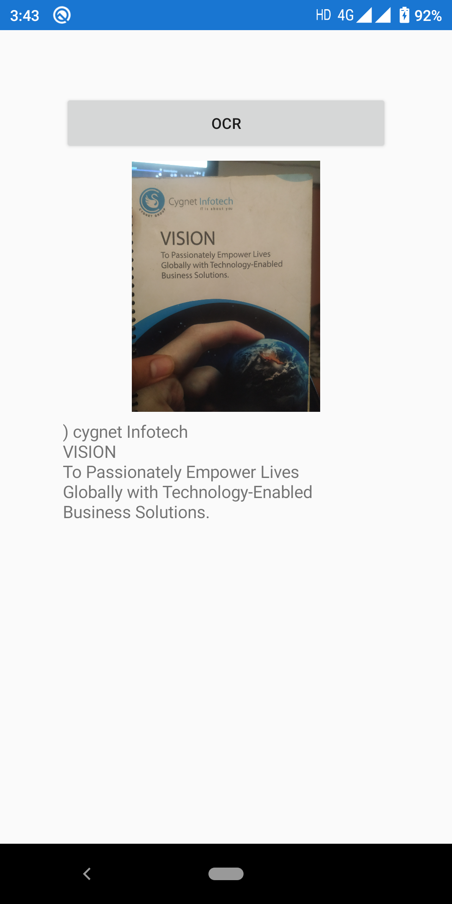

# ImageToText
This project is about extracting text from a image using Azure Computer Vision to use this project you need to get your COMPUTER VISION SUBSCRIPTION KEY from [here](https://azure.microsoft.com/en-us/try/cognitive-services/my-apis/?api=computer-vision) 

You also need to add some nuget
>Microsoft.Azure.CognitiveServices.Vision.ComputerVision

>Xam.Plugin.Media

>Newtonsoft.Json

# Actual Output Demo 

